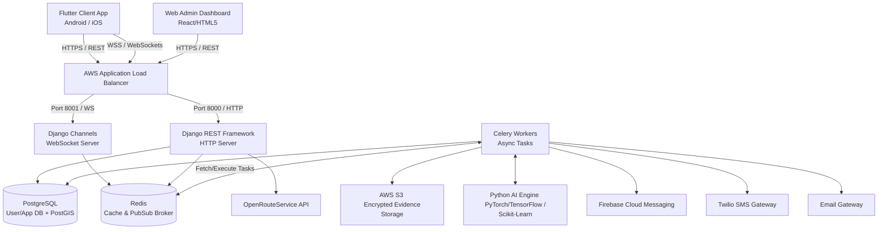
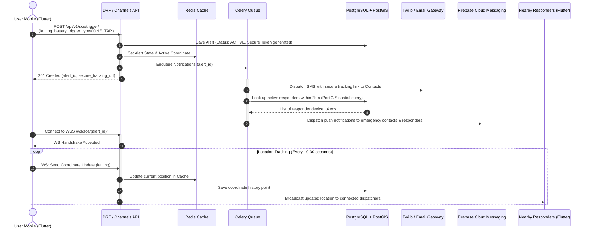
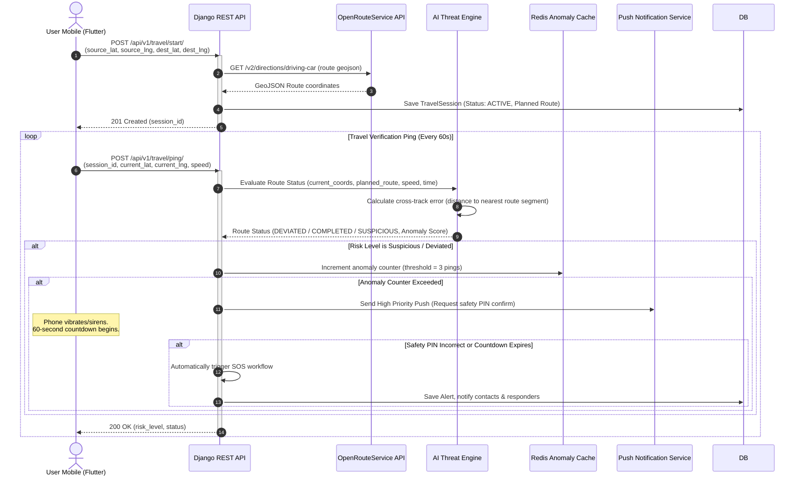
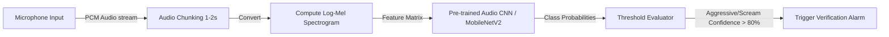

# Saathi Shield - System Architecture Design

This document details the high-level system architecture, real-time communications flow, AI/ML pipelines, mobile hardware integrations, and deployment model for the **Saathi Shield** Personal Safety and Emergency Response Platform.

---

## 1. High-Level Architectural Overview

Saathi Shield uses a distributed, event-driven architecture designed for high availability, low-latency communication, and secure processing of emergency events.

### Components Description

1. **Flutter Mobile Application**:
   * **State Management**: BLoC or Provider for structured state updates.
   * **Location Tracker**: Background geolocator plugin running as a background service to monitor user coordinates.
   * **On-Device Fall Detection**: Continuously samples accelerometer/gyroscope signals, filtering out normal movement noise before running thresholding checks.
   * **On-Device Voice Command Recognition**: Employs a lightweight keyword-spotting engine (e.g., PocketSphinx or on-device Speech-To-Text API) to trigger the emergency workflow offline or stream audio for validation.
   * **Evidence Capture System**: Runs concurrent camera and audio capture, splitting the recorded streams into small, encrypted media segments and uploading them to S3.

2. **Django & Django REST Framework (DRF) Web Backend**:
   * Handles user accounts, profile registration, OTP validation, emergency contact definitions, configuration management, and admin views.
   * Provides JSON-formatted REST responses secured via JSON Web Tokens (JWT).

3. **Django Channels (WebSockets)**:
   * Maintains persistent, bi-directional connections to active clients.
   * Handles real-time location stream broadcasts from SOS victims to loved ones and nearby responders.
   * Broadcasts urgent dispatch messages to available community responders.

4. **Redis Cache & Message Broker**:
   * Acts as the Django Channels channel layer backend (pub/sub).
   * Stores temporary, fast-changing geospatial locations (e.g., active responder positions and active travel paths).
   * Manages Celery async task scheduling and message routing.

5. **Celery Workers**:
   * Processes out-of-band operations such as routing calculations, SMS/Push notification alerts, media file packaging, and database cleanups.
   * Regularly fetches government weather/disaster feeds to issue regional alerts.

6. **AI / ML Engine**:
   * **Threat Classifier**: Analyzes historical crime metadata, time of day, location, and speed anomalies to assign a hazard rating.
   * **Acoustic Distress Detector**: Classifies audio inputs to identify screams or aggressive shouting.

7. **Databases**:
   * **PostgreSQL + PostGIS**: Maintains relational tables (users, contacts, travel records, history logs) with GIS extensions for mapping nearest responders.
   * **AWS S3**: An isolated, secure container for storing chunked, client-encrypted evidence media files.

---

## 2. Key Interaction Flows & Sequence Diagrams

### 2.1 One-Tap SOS Activation Sequence

The diagram below details the step-by-step pipeline when a user triggers the main SOS emergency button:

### 2.2 Safe Travel Mode & Deviation Monitoring

The route deviation and anomaly detection workflow operates as a semi-automated guardrail:

---

## 3. AI Modules & Threat Detection Pipelines

### 3.1 Proactive AI Threat Detection Engine
This module estimates the general risk factor of an area or route. It combines static parameters (time, region) with dynamic behavioral data (route deviation, speed changes).

* **Model Framework**: Python-based Scikit-Learn Random Forest Classifier or LightGBM model.
* **Input Features**:
  1. **Spatial Features**: Crime density index (obtained from historical incident reports), population density grid index.
  2. **Temporal Features**: Time of day (0-24 hour sine/cosine projection), day of the week, holiday flags.
  3. **Behavioral Features**: Cross-track error (meters away from optimal routing), movement velocity deviation (unusual stops, walking vs. vehicle mismatch).
* **Output Classifications**:
  * **Safe (Score 0 - 35)**: Proceeding normally on path.
  * **Suspicious (Score 36 - 70)**: Route deviation detected, unusual stops, or late-night walk in high-crime density index.
  * **Dangerous (Score 71 - 100)**: Route deviation + prolonged stop + no user feedback, or direct collision impact.

### 3.2 Audio Distress Classification Pipeline
Identifies emergency events using micro-sound snippets.

* **On-Device vs. Server Execution**: 
  * The Flutter app records audio in 2-second overlapping segments.
  * A lightweight local CNN (TFLite implementation) checks for generic high-pitch scream profiles.
  * If identified, the raw snippet is securely dispatched to the backend API (`POST /api/v1/evidence/upload/`) for verification by a larger server-side model (PyTorch Audio CNN) and stored as secure evidence.

---

## 4. Mobile Hardware Integrations & Background Processing

For Saathi Shield to offer reliable real-time protection, the mobile application interacts with device hardware components through isolated native channels:

1. **Background Service Lifecycle**:
   * Uses native service structures (`Foreground Service` on Android with a persistent notification, and `Background Fetch/Location` with high accuracy permissions on iOS).
   * Ensures the operating system does not kill the thread during travel mode or active SOS tracking.

2. **Sensors (Accelerometer + Gyroscope)**:
   * Listens to sensor stream updates at a frequency of 50Hz.
   * **Fall Detection Algorithm**: Calculates total acceleration magnitude:
     $$A_m = \sqrt{a_x^2 + a_y^2 + a_z^2}$$
   * A fall is registered if $A_m$ falls below a low-G threshold (free fall, e.g., $< 0.3g$) followed by a high-G spike (impact collision, e.g., $> 3.0g$) and subsequent lack of angular velocity variation (inactivity).

3. **Siren & Flashlight Integration**:
   * Toggles the system torch at 200ms intervals during SOS (strobe light).
   * Sets screen brightness to 100% and triggers full-screen alarms using maximum media volume for the siren output.

4. **Evidence Security**:
   * Video and audio streams are written directly to temporary flash directories using a local AES-256 symmetric key generated per SOS session.
   * Chunks are sequentially uploaded to the server, meaning even if the assailant smashes the physical device, the previously uploaded segments remain safely stored on S3.

---

## 5. Deployment & AWS-Ready Infrastructure

The deployment layout is structured to handle spikes in traffic during public emergencies while ensuring extreme isolation for user safety databases.

### Infrastructure Components

1. **DNS & Edge Network**: AWS Route 53 routes incoming requests. CloudFront distributes static assets (such as tracking portal scripts) and enforces Web Application Firewall (WAF) rule sets to prevent DDoS attacks.
2. **Compute Node (Dockerized Web)**: AWS Elastic Container Service (ECS) running Fargate tasks. Scaling triggers on memory usage or incoming WebSocket connections count.
3. **Database Layer (RDS PostgreSQL)**:
   * Multi-AZ deployment for failover recovery.
   * Point-in-time recovery enabled.
   * PostGIS spatial indexing enabled.
4. **Cache & WebSocket State Management**: AWS ElastiCache for Redis.
5. **Security & Cryptography**:
   * AWS Key Management Service (KMS) for envelope encryption of media files.
   * All API traffic enforces SSL/TLS 1.3 protocol requirements.
